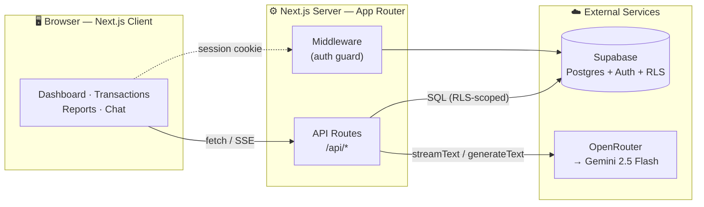
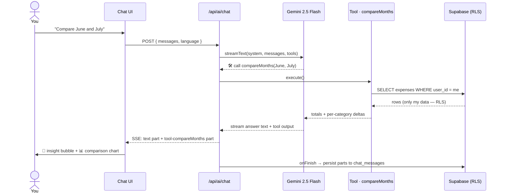
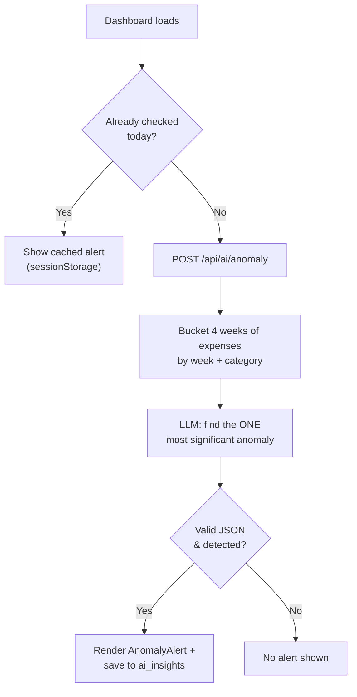
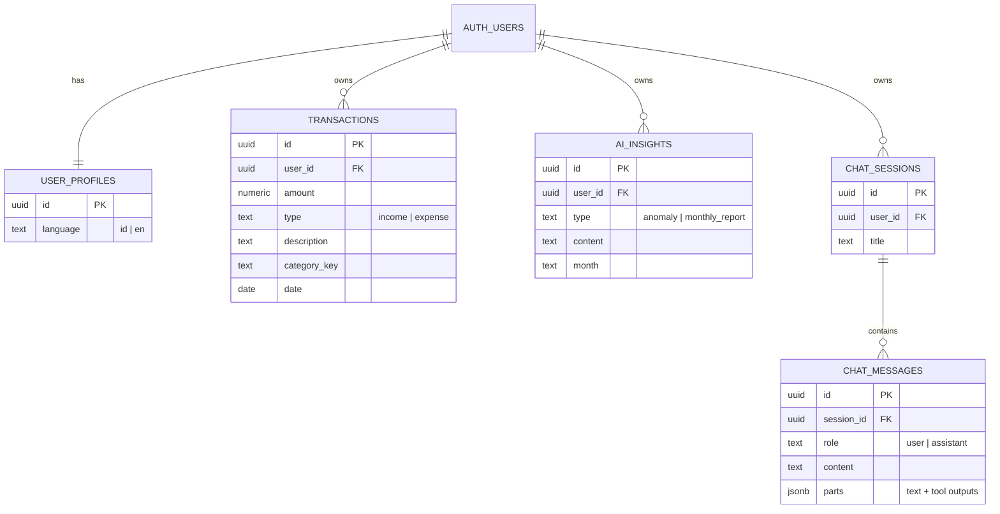

# 💸 Smart Finn Track

> An AI-powered personal finance tracker that doesn't just show you charts — it *talks* to you about your money.

Ask **"how much did I spend on food in June?"** and it queries your real transactions, thinks, and answers with a number *and* a chart. Spot a spending spike before you do. Switch between 🇮🇩 Bahasa Indonesia and 🇬🇧 English with one tap. Built as a full-stack showcase of **agentic AI + a real database + a polished product UI**.

<p align="center">
  <em>Next.js 15 · React 19 · TypeScript · Supabase · Vercel AI SDK · Gemini 2.5 Flash</em>
</p>

---

## ✨ What makes it interesting

Most finance apps are a spreadsheet with a nicer font. This one has three ideas worth a closer look:

1. **An AI advisor that runs SQL for you.** The chat isn't a chatbot with canned replies — the model has **7 real tools** it can call to query your database mid-conversation, then reasons over the results. It even renders interactive charts *inside* the chat bubbles.
2. **Proactive anomaly detection.** Every day, an LLM quietly buckets your last 4 weeks of spending by week and category, and surfaces the *single* most significant spike ("Entertainment is up 42% this week") — with the exact transactions to blame.
3. **Security by construction.** Every table is protected by Postgres **Row-Level Security**. Even the AI's tools physically cannot read another user's data — the database enforces it, not the app code.

---

## 🎬 Features at a glance

| Area | What you get |
|------|--------------|
| 📊 **Dashboard** | Income / expense / balance cards, category donut, a daily-spend trend with 7/30/90-day toggles, month picker, and CSV export. |
| 🧾 **Transactions** | Searchable, filterable list with pagination. New entries are **auto-categorized by AI** on the fly. |
| 🤖 **AI Advisor** | Streaming chat with tool-calling, inline charts, and full conversation history that reloads charts and all. |
| 🚨 **Anomaly Alerts** | Daily LLM scan that flags unusual spending, with the culprit transactions. |
| 📑 **Reports** | AI-generated monthly narrative + visual breakdowns. |
| 🌍 **Bilingual** | Full 🇮🇩 / 🇬🇧 UI via `next-intl`, currency formatted the Indonesian way (`Rp 1.240.000`). |

---

## 🧠 How it works

### System architecture

The client talks to Next.js API routes; those routes are the *only* thing that touches Supabase and the LLM. Secrets never reach the browser.



### The star: the AI tool-calling loop

This is what happens when you type *"Compare my June and July spending."* The model decides **which** tool to call, the tool runs a scoped SQL query, and the model turns the raw rows into a sentence + a chart. Up to 5 reasoning/tool steps per turn.



> 💡 **Why persist the "parts"?** Each assistant message is stored as its full structured AI-SDK payload (`jsonb`), not just text. So when you reopen an old conversation, the **charts re-render from history** instead of showing bare numbers.

### Anomaly detection, daily



---

## 🗄️ Data model

Five tables, all keyed to the Supabase auth user, all under Row-Level Security (`auth.uid() = user_id`).



---

## 🛠️ Tech stack

| Layer | Choice | Why |
|-------|--------|-----|
| **Framework** | Next.js 15 (App Router) + React 19 | Server components, route handlers, streaming. |
| **Language** | TypeScript | End-to-end type safety. |
| **Styling** | Tailwind CSS (class dark mode) | Fast, consistent, theme-aware. |
| **Database & Auth** | Supabase (Postgres + RLS) | One service for data, auth, and row-level security. |
| **AI** | Vercel AI SDK (`ai`) + OpenRouter → `google/gemini-2.5-flash` | Tool-calling + streaming; model is swappable in one line. |
| **Validation** | Zod | Tool input schemas the model must satisfy. |
| **Charts** | Recharts | Dashboard trend + donut. |
| **i18n** | next-intl | Bilingual 🇮🇩 / 🇬🇧. |

---

## 🤖 The AI toolbox

The advisor can call any of these ([`src/lib/ai/tools.ts`](src/lib/ai/tools.ts)). Two of them stream chart data the UI renders inline.

| Tool | What it answers | Renders a chart? |
|------|-----------------|:---:|
| `getTransactions` | "Show my food spending last month" | — |
| `getMonthlySummary` | "What's my balance this month?" | — |
| `getCategoryBreakdown` | "Where did my money go?" | ✅ |
| `getSpendingTrend` | "Am I spending more over time?" | — |
| `getTopExpenses` | "What were my biggest purchases?" | — |
| `getBalance` | "How do I compare to last month?" | — |
| `compareMonths` | "Compare April and May" | ✅ |

All date math is anchored to **Asia/Jakarta**, so "this month" is correct no matter where the server runs.

---

## 📁 Project structure

```
src/
├── app/
│   ├── (app)/                 # Auth-protected area
│   │   ├── dashboard/         # Metrics, charts, anomaly alert
│   │   ├── transactions/      # List, search, add, delete
│   │   ├── reports/           # AI monthly report
│   │   ├── chat/              # AI advisor
│   │   └── settings/          # Language, logout
│   ├── api/
│   │   ├── ai/                # chat · anomaly · report · categorize
│   │   ├── chat/sessions/     # Conversation history CRUD
│   │   ├── transactions/      # Transaction CRUD
│   │   ├── reports/           # Report data
│   │   └── user/              # Profile · language
│   ├── login/ · register/ · onboarding/
│   └── page.tsx               # Landing
├── components/                # UI: dashboard, chat, transactions, layout…
├── lib/
│   ├── ai/                    # tools.ts · prompts.ts
│   ├── supabase/              # client · server · middleware
│   ├── llm.ts                 # OpenRouter config + DEFAULT_MODEL
│   └── format.ts              # Rupiah / percent formatting
├── i18n/                      # Locale provider
└── messages/                  # en.json · id.json
supabase/
├── schema.sql                # Core tables + RLS
├── chat-history.sql          # Chat sessions/messages + RLS
└── Seed Current Months…sql    # Demo data
```

---

## 🚀 Getting started

### Prerequisites
- Node.js 18+
- A [Supabase](https://supabase.com) project (free tier is fine)
- An [OpenRouter](https://openrouter.ai) API key

### 1. Install

```bash
git clone <your-repo-url>
cd AIFinanceTracker_claude
npm install
```

### 2. Environment

Create `.env.local` in the project root:

```bash
NEXT_PUBLIC_SUPABASE_URL=https://YOUR-PROJECT.supabase.co
NEXT_PUBLIC_SUPABASE_ANON_KEY=your-anon-key
OPENROUTER_API_KEY=your-openrouter-key
```

### 3. Set up the database

In the Supabase **SQL Editor**, run these once, in order:

1. `supabase/schema.sql` — core tables + RLS + the sign-up trigger
2. `supabase/chat-history.sql` — chat sessions & messages + RLS

Want data to play with? Open `supabase/Seed Current Months for Demo User.sql`, change the email on line 6 to your account, and run it.

### 4. Run

```bash
npm run dev
```

Open <http://localhost:3000>, register an account, and start asking your money questions.

### Scripts

| Command | Does |
|---------|------|
| `npm run dev` | Start the dev server |
| `npm run build` | Production build |
| `npm run start` | Serve the production build |
| `npm run lint` | ESLint |
| `npm run typecheck` | `tsc --noEmit` |

---

## 🧩 Notable design decisions

- **The database is the security boundary.** RLS policies (`auth.uid() = user_id`) mean the AI's tools query the DB *as the user* — a bug in tool code can't leak another user's transactions.
- **Charts survive reloads.** Assistant messages persist their structured `parts` (`jsonb`), so reopening a chat re-renders the exact charts, not just text.
- **Timezone-correct dates.** "This month" / "last month" are computed against `Asia/Jakarta`, independent of where the app is deployed.
- **Model-agnostic AI.** Everything routes through OpenRouter via one `DEFAULT_MODEL` constant in [`src/lib/llm.ts`](src/lib/llm.ts) — swap Gemini for any other model without touching feature code.
- **Free-tier friendly.** A GitHub Actions [keep-alive workflow](.github/workflows/keep-alive.yml) pings Supabase every 5 days so the project never pauses from inactivity.

---

<p align="center"><sub>Built with Next.js, Supabase, and a chat model that isn't afraid of your bank statement.</sub></p>
