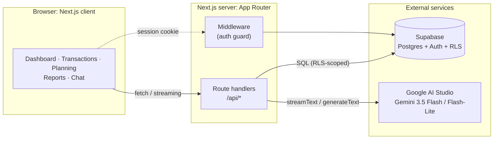
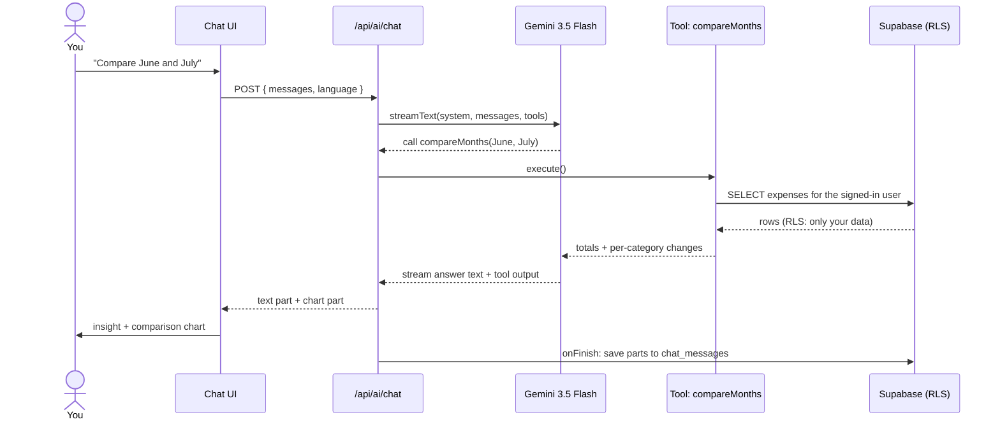
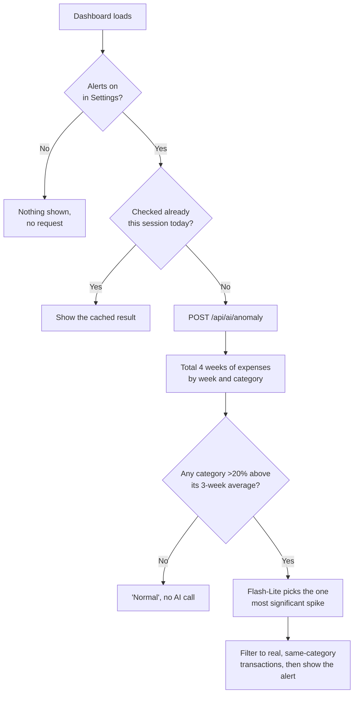
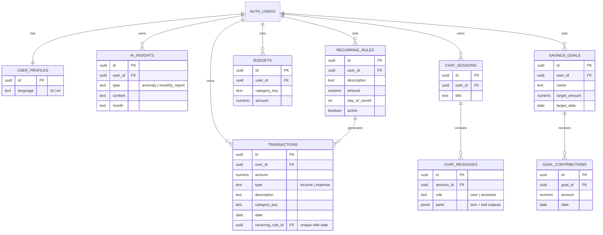

# Smart Finn Track

**A bilingual personal finance tracker with an AI advisor that answers from your real transactions, not from a script.**

Ask *"how much did I spend on food in June?"* and the advisor queries your data, does the math, and replies with the number and a chart. Type *"kopi 25rb kemarin"* and a transaction drafts itself. Photograph a receipt and the total, date and shop fill in. The whole app runs in Bahasa Indonesia or English, and all of it runs on free tiers.

<p align="center">
  <a href="https://ai-finance-tracker-delta-drab.vercel.app"></a>
  <a href="https://github.com/filan214/AIFinanceTracker/actions/workflows/ci.yml"></a>
  
  
  
  
  
  
</p>

<p align="center"><a href="https://ai-finance-tracker-delta-drab.vercel.app"><strong>Open the live demo</strong></a> and press <strong>Try the demo</strong>. No sign-up needed.</p>

---

## Try it in a minute

The demo account comes with a few months of seeded transactions, budgets and goals. Some things worth doing:

| Try this | Where | What happens |
|---|---|---|
| Ask *"Compare August and September"* | Chat Advisor | The model calls a `compareMonths` tool and answers with a chart inside the reply |
| Type *"makan siang 35rb kemarin"* and press Fill | Add transaction | Amount, date, type and category are drafted for you to confirm |
| Scan a photo of a receipt | Add transaction | Total, date and merchant are read from the image |
| Switch ID / EN | Sidebar or header | The UI, the AI's replies and number formats all follow (`Rp 1.240.000` vs `Rp 1,240,000`) |
| Download the PDF | Reports | A monthly report with tables, ready to print or share |

---

## What it does

| Area | Features |
|---|---|
| **Dashboard** | Income, expenses and balance (a deficit shows as a negative, in red), category donut, daily trend with every day of the month, budget and goal cards, a plain-language month summary, CSV export |
| **Transactions** | Search and filters, AI categorization with a keyword fallback, quick-add from a sentence, receipt scanning, bank CSV import with auto-detected columns and duplicate checks |
| **Planning** | Monthly category budgets (ok, near limit, over), savings goals with top-ups and the monthly amount needed to hit a date, recurring transactions that fill in missed months |
| **AI advisor** | Streaming chat with 9 database tools, charts inside replies, saved conversations that reopen with their charts |
| **Anomaly alerts** | Flags the one category that jumped this week, with the transactions behind it |
| **Reports** | Monthly breakdown, biggest movers, 6-month trend, an AI-written summary on request, PDF download |
| **Personal touch** | Bahasa Indonesia or English, light, dark or system theme, five accent colors |

---

## Engineering highlights

### 1. An advisor that queries, not guesses

The chat model has nine tools ([`src/lib/ai/tools.ts`](src/lib/ai/tools.ts)) and decides which to call: monthly totals, category breakdowns, trends, top expenses, month comparisons, budgets, goals. Each tool runs a Postgres query scoped to the signed-in user, and the model writes its answer from the rows it gets back. Two tools stream chart data that the UI renders inside the chat bubble. Messages are stored as their full structured parts (`jsonb`), so an old conversation reopens with its charts intact.

### 2. Built to live on a free AI quota

The free tier of Gemini allows only a handful of requests, so every call is treated as a cost:

- **Keyword rules before AI.** "gojek", "kopi" or "listrik" are categorized by rules; only descriptions the rules don't recognize reach the model. CSV imports send just the unrecognized rows, in batches of 50.
- **A deterministic gate before the anomaly check.** The dashboard only asks the model about anomalies when some category is more than 20% above its 3-week average. Ordinary weeks cost nothing.
- **Two models, two quotas.** Simple jobs (categorizing, parsing, chat titles, anomalies) run on Gemini 3.5 Flash-Lite, which has its own quota. Chat, receipts and reports keep 3.5 Flash.
- **Thinking turned off.** Flash's hidden reasoning tokens count against the output limit, and they were cutting off short JSON answers (a category is a 16-token reply). Disabling them fixed truncated receipts and empty categories.
- **Honest failure messages.** When the quota runs out, a receipt scan says *"AI is busy or at today's limit"* instead of blaming the photo. That distinction came out of a real debugging session, where clear receipts were "unreadable" because every request was being rate-limited upstream.

### 3. Every AI path has a fallback

AI output is always a draft the user confirms. If the model is down or rate-limited, categorization and quick-add fall back to rules, a receipt scan leaves the form usable, and chat retries before showing a localized error. The app never blocks on the model.

### 4. The database is the security boundary

Every table sits behind Postgres Row-Level Security (`auth.uid() = user_id`). The AI's tools query the database as the signed-in user, so even a bug in tool code cannot read another user's transactions. The Gemini key lives only on the server.

### 5. Recurring transactions without a scheduler

There's no cron job. When the app opens, missed occurrences of each recurring rule are created on the spot. A unique index on `(recurring_rule_id, date)` makes that safe to run from two tabs at once: the second insert is a no-op. Pausing and resuming a rule doesn't back-fill the paused months.

### 6. UI that doesn't pretend

Inside the app, every number comes from your data or isn't shown. Deficits keep their minus sign, charts plot days with no spending as zero instead of drawing a line across them, and controls that did nothing were either wired up or removed. Category labels and chart text were measured against WCAG AA contrast in both themes, and the main pages were checked at a 390px phone width for sideways scrolling.

---

## How it works

### System architecture

The browser only talks to Next.js route handlers. Those are the only code that reaches Supabase or the model, so no secret ever ships to the client.


```mermaid
flowchart LR
    subgraph Client["Browser: Next.js client"]
        UI["Dashboard · Transactions · Planning<br/>Reports · Chat"]
    end
    subgraph Server["Next.js server: App Router"]
        MW["Middleware<br/>(auth guard)"]
        API["Route handlers<br/>/api/*"]
    end
    subgraph Ext["External services"]
        SB[("Supabase<br/>Postgres + Auth + RLS")]
        AI["Google AI Studio<br/>Gemini 3.5 Flash / Flash-Lite"]
    end

    UI -->|fetch / streaming| API
    UI -.->|session cookie| MW
    MW --> SB
    API -->|"SQL (RLS-scoped)"| SB
    API -->|"streamText / generateText"| AI
```

### The tool-calling loop

What happens when you type *"Compare my June and July spending"*. The model can take up to five tool or reasoning steps per turn.


```mermaid
sequenceDiagram
    actor U as You
    participant C as Chat UI
    participant API as /api/ai/chat
    participant LLM as Gemini 3.5 Flash
    participant T as Tool: compareMonths
    participant DB as Supabase (RLS)

    U->>C: "Compare June and July"
    C->>API: POST { messages, language }
    API->>LLM: streamText(system, messages, tools)
    LLM-->>API: call compareMonths(June, July)
    API->>T: execute()
    T->>DB: SELECT expenses for the signed-in user
    DB-->>T: rows (RLS: only your data)
    T-->>LLM: totals + per-category changes
    LLM-->>API: stream answer text + tool output
    API-->>C: text part + chart part
    C->>U: insight + comparison chart
    API->>DB: onFinish: save parts to chat_messages
```

### Anomaly detection


```mermaid
flowchart TD
    A["Dashboard loads"] --> S{"Alerts on<br/>in Settings?"}
    S -->|No| N["Nothing shown,<br/>no request"]
    S -->|Yes| B{"Checked already<br/>this session today?"}
    B -->|Yes| C["Show the cached result"]
    B -->|No| D["POST /api/ai/anomaly"]
    D --> E["Total 4 weeks of expenses<br/>by week and category"]
    E --> G{"Any category >20% above<br/>its 3-week average?"}
    G -->|No| N2["'Normal', no AI call"]
    G -->|Yes| F["Flash-Lite picks the one<br/>most significant spike"]
    F --> H["Filter to real, same-category<br/>transactions, then show the alert"]
```

---

## Data model

Nine tables, all keyed to the Supabase auth user and all under Row-Level Security.


```mermaid
erDiagram
    AUTH_USERS ||--|| USER_PROFILES : has
    AUTH_USERS ||--o{ TRANSACTIONS : owns
    AUTH_USERS ||--o{ AI_INSIGHTS : owns
    AUTH_USERS ||--o{ CHAT_SESSIONS : owns
    CHAT_SESSIONS ||--o{ CHAT_MESSAGES : contains
    AUTH_USERS ||--o{ BUDGETS : sets
    AUTH_USERS ||--o{ SAVINGS_GOALS : sets
    SAVINGS_GOALS ||--o{ GOAL_CONTRIBUTIONS : receives
    AUTH_USERS ||--o{ RECURRING_RULES : sets
    RECURRING_RULES ||--o{ TRANSACTIONS : generates

    USER_PROFILES {
        uuid id PK
        text language "id | en"
    }
    TRANSACTIONS {
        uuid id PK
        uuid user_id FK
        numeric amount
        text type "income | expense"
        text description
        text category_key
        date date
        uuid recurring_rule_id FK "unique with date"
    }
    AI_INSIGHTS {
        uuid id PK
        uuid user_id FK
        text type "anomaly | monthly_report"
        text content
        text month
    }
    CHAT_SESSIONS {
        uuid id PK
        uuid user_id FK
        text title
    }
    CHAT_MESSAGES {
        uuid id PK
        uuid session_id FK
        text role "user | assistant"
        jsonb parts "text + tool outputs"
    }
    BUDGETS {
        uuid id PK
        uuid user_id FK
        text category_key
        numeric amount
    }
    SAVINGS_GOALS {
        uuid id PK
        uuid user_id FK
        text name
        numeric target_amount
        date target_date
    }
    GOAL_CONTRIBUTIONS {
        uuid id PK
        uuid goal_id FK
        numeric amount
        date date
    }
    RECURRING_RULES {
        uuid id PK
        uuid user_id FK
        text description
        numeric amount
        int day_of_month
        boolean active
    }
```

---

## Tech stack

| Layer | Choice | Why |
|---|---|---|
| Framework | Next.js 15 (App Router) + React 19 | Route handlers, streaming responses, one deploy |
| Language | TypeScript | Typed API payloads, tools and components |
| Styling | Tailwind CSS | Light, dark and accent themes from CSS variables |
| Database and auth | Supabase (Postgres + RLS) | Data, sessions and row-level security in one service |
| AI | Vercel AI SDK + `@ai-sdk/google` | Tool calling and streaming; the model is one constant in [`src/lib/llm.ts`](src/lib/llm.ts) |
| Validation | Zod | Request bodies and the tool inputs the model must satisfy |
| Charts | Recharts | Dashboard trend and category donut |
| PDF | jsPDF + jspdf-autotable | Monthly report download |
| i18n | next-intl | Bahasa Indonesia and English, with matching message files |
| Tests | Vitest | Fast unit tests for the logic that decides what you see |

---

## The AI toolbox

| Tool | Answers questions like | Chart in reply |
|---|---|:---:|
| `getTransactions` | "Show my food spending last month" | |
| `getMonthlySummary` | "What's my balance this month?" | |
| `getCategoryBreakdown` | "Where did my money go?" | ✓ |
| `getSpendingTrend` | "Am I spending more over time?" | |
| `getTopExpenses` | "What were my biggest purchases?" | |
| `getBalance` | "How do I compare to last month?" | |
| `compareMonths` | "Compare April and May" | ✓ |
| `getBudgets` | "Am I over budget on shopping?" | |
| `getGoals` | "When will I reach my laptop goal?" | |

Date math is anchored to Asia/Jakarta, so "this month" is right wherever the server runs.

---

## Testing and quality

- **Unit tests (Vitest)** cover the logic behind what you see: quick-add parsing, keyword categorization, CSV column mapping and duplicate detection, the anomaly gate, budget and goal progress, recurring due dates, receipt parsing, the dashboard's day-by-day series and month summary, and the PDF builder.
- **CI** runs typecheck, lint and the test suite on every push ([`ci.yml`](.github/workflows/ci.yml)).
- **Bilingual parity**: `messages/en.json` and `messages/id.json` hold the same keys.
- **Keep-alive**: a scheduled workflow ([`keep-alive.yml`](.github/workflows/keep-alive.yml)) pings Supabase so the free project doesn't pause from inactivity.

---

## Project structure

```
src/
├── app/
│   ├── (app)/                 # Signed-in area
│   │   ├── dashboard/         # Metrics, charts, anomaly alert, month summary
│   │   ├── transactions/      # List, search, add, import, delete
│   │   ├── planning/          # Budgets, goals, recurring
│   │   ├── reports/           # Monthly report + PDF
│   │   ├── chat/              # AI advisor
│   │   └── settings/          # Language, theme, accent, alerts
│   ├── api/
│   │   ├── ai/                # chat · anomaly · report · categorize · parse · receipt
│   │   ├── budgets/ · goals/ · recurring/
│   │   ├── transactions/      # CRUD + CSV import
│   │   ├── chat/sessions/     # Conversation history
│   │   └── reports/ · user/
│   ├── login/ · register/ · onboarding/
│   └── page.tsx               # Landing
├── components/                # dashboard, chat, transactions, planning, layout, ui
├── lib/
│   ├── ai/                    # tools.ts · prompts.ts · dates.ts
│   ├── csv/                   # parse · map · batch
│   ├── supabase/              # client · server · middleware
│   ├── llm.ts                 # Models, quotas, thinking settings
│   ├── category-rules.ts      # Keyword categorization
│   ├── report-pdf.ts          # PDF builder
│   └── …                      # Pure, tested helpers
├── i18n/                      # Locale provider
messages/                      # en.json · id.json
supabase/                      # schema.sql · chat-history.sql · planning.sql · seeds
```

---

## Run it yourself

### Prerequisites

- Node.js 20+
- A [Supabase](https://supabase.com) project (the free tier is fine)
- A [Google AI Studio](https://aistudio.google.com) API key (the free tier is enough)

### 1. Install

```bash
git clone https://github.com/filan214/AIFinanceTracker.git
cd AIFinanceTracker
npm install
```

### 2. Environment

Create `.env.local` in the project root:

```bash
NEXT_PUBLIC_SUPABASE_URL=https://YOUR-PROJECT.supabase.co
NEXT_PUBLIC_SUPABASE_ANON_KEY=your-anon-key
GOOGLE_GENERATIVE_AI_API_KEY=your-google-ai-studio-key

# Optional: shows a one-click "Try the demo" button.
# Use a dedicated, throwaway demo account, never a personal one:
# these values end up in the client bundle. Leave them unset to hide the button.
NEXT_PUBLIC_DEMO_EMAIL=demo@example.com
NEXT_PUBLIC_DEMO_PASSWORD=the-demo-password
```

### 3. Database

In the Supabase SQL Editor, run these once, in order:

1. `supabase/schema.sql`: core tables, RLS and the sign-up trigger
2. `supabase/chat-history.sql`: chat sessions and messages
3. `supabase/planning.sql`: budgets, goals and recurring rules

For sample data, open the `supabase/Seed …for Demo User.sql` files, change the email to your account, and run them.

### 4. Start

```bash
npm run dev
```

Open <http://localhost:3000>, create an account, and start asking about your money.

### Scripts

| Command | Does |
|---|---|
| `npm run dev` | Development server |
| `npm run build` | Production build |
| `npm run start` | Serve the production build |
| `npm test` | Vitest unit tests |
| `npm run lint` | ESLint |
| `npm run typecheck` | `tsc --noEmit` |

---

<p align="center"><sub>Built with Next.js, Supabase and Gemini, by Valentinus Filan.</sub></p>
